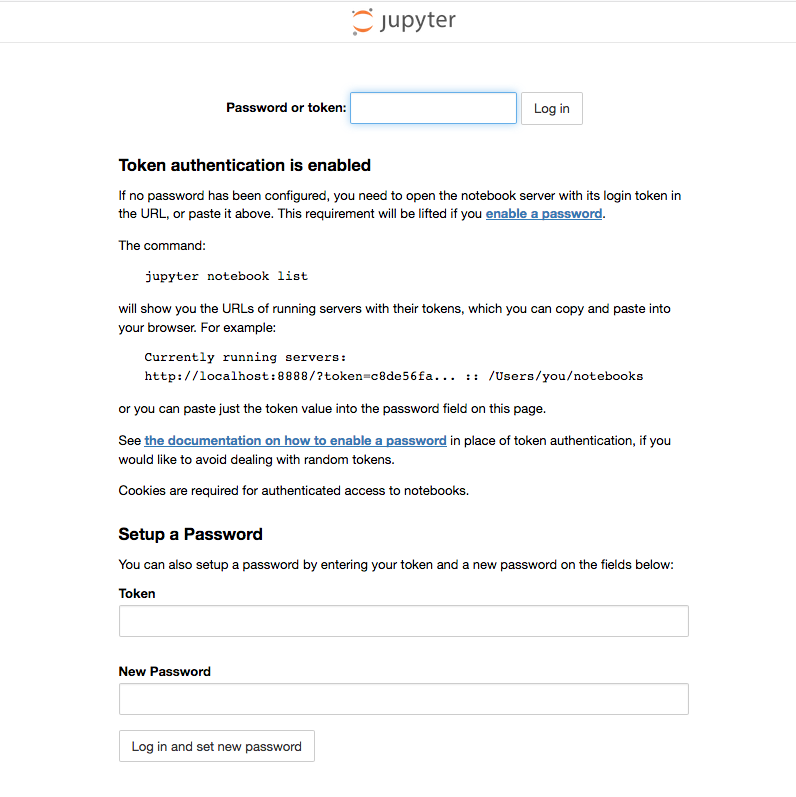
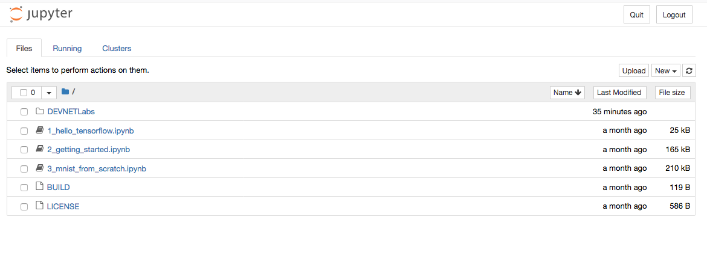
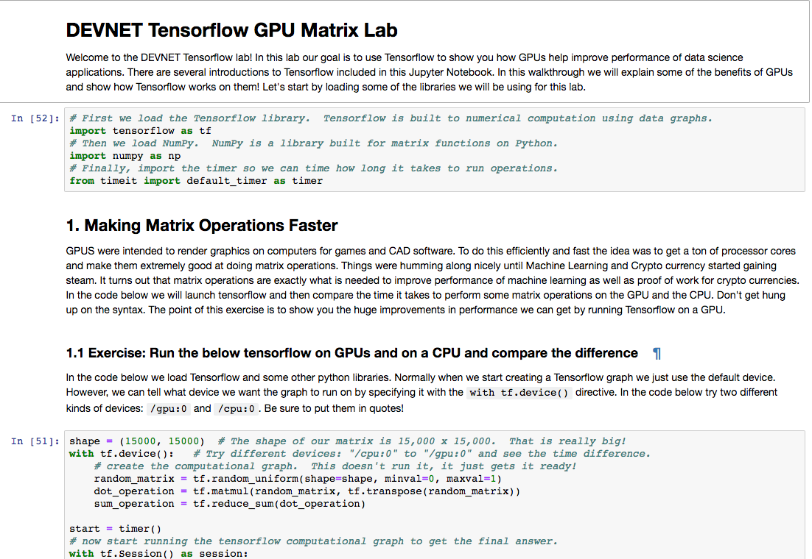

# DevNet Sandbox Tensorflow Lab

These are instructions for running the DEVNET sandbox for deep learning on the B200 M5 blade which includes the NVIDIA P6 GPU. 

## Initial Setup

* [Install OS (Centos 7.5 or Ubuntu 16.04)](#install-os)
* [Install NVIDIA Drivers](#install-nvidia-drivers)
* [Install Docker](#install-docker)
* [Install NVIDIA-Docker](#install-nvidia-docker)

### Install OS

We install CentOS7 but Ubuntu 16.04 seems to be referenced from most of the CUDA documentation. Make sure there is actually a GPU in this machine

```
lspci 
```

Should show something like: 

```
...
d8:00.0 3D controller: NVIDIA Corporation GP104GL [Tesla P6] (rev a1)
``` 

The OS doesn't need any desktop software so the bare minimal installation is probably fine. 

### Install NVIDIA Drivers

[Section 4](http://developer.download.nvidia.com/compute/cuda/6_5/rel/docs/CUDA_Getting_Started_Linux.pdf) of the getting started with CUDA guide has information about the process of loading the NVIDIA drivers. Basically the process is: 


3. Blacklist the default nouvea driver 
3. Generate the new initrd and grub file
4. Install the new driver

Do all of these as the ```root``` user. 

#### Blacklist the nouvea Driver

Create the file ```/etc/modprobe.d/blacklist.conf```.  Add the following line to it: 

```
blacklist nouveau
```

Append to ```/etc/default/grub``` the following: 

```
GRUB_CMDLINE_LINUX="crashkernel=auto rd.lvm.lv=centos/root rd.lvm.lv=centos/swap rhgb quiet rd.driver.blacklist=nouveau nouveau.modeset=0"
```

#### Generate the new initrd and grub file

Back up old kernel/ramdisk and generate new one with the driver: 

```
sudo mv /boot/initramfs-$(uname -r).img /boot/initramfs-$(uname -r)-nouveau.img
sudo dracut /boot/initramfs-$(uname -r).img $(uname -r)
```

Now build the new grub file:

```
grub2-mkconfig -o /boot/grub2/grub.cfg
```

Reboot the machine: 

```
shutdown -r now
```

#### Install the new driver

Because kernel versions may differ, I downloaded the source file and built from there. To do this we go to NVIDIA's developer page, fill out the form and download the linux driver. 

```
chmod 755 NVIDIA-Linux*
sudo ./NVIDIA-Linux-x86_64-396.44run
```

This step only works if the nouveau driver is disabled.  So doing the first 2 steps is pretty important. Once done you should be able to see the nvidia drivers in ```lsmod```.  It is recommended to reboot at this step as well. 

### Install Docker

```
yum install -y yum-utils
yum-config-manager --add-repo https://download.docker.com/linux/centos/docker-ce.repo
yum install -y docker-ce
systemctl start docker
systemctl enable docker
```

### Install NVIDIA Docker

```nvidia-docker``` is a way to start docker containers that can access the resources of the machine.  

Download the repo: 

```
distribution=$(. /etc/os-release;echo $ID$VERSION_ID)
curl -s -L https://nvidia.github.io/nvidia-docker/$distribution/nvidia-docker.repo | \
  sudo tee /etc/yum.repos.d/nvidia-docker.repo
```

Install the binary and restart docker: 

```
sudo yum install -y nvidia-docker2
sudo pkill -SIGHUP dockerd
 
# Test nvidia-smi with the latest official CUDA image
docker run --runtime=nvidia --rm nvidia/cuda nvidia-smi
```


## Install the Lab

* [The model](#the-model)
* [Start the Lab](#the-lab)

### The Model

We need to download the trained model [imagenet-vgg-verydeep-19.mat](http://www.vlfeat.org/matconvnet/pretrained/#downloading-the-pre-trained-models).  This file is 511MB.  We put it in the ```~/pretrained-model``` directory to be mounted read-only to the docker containers.  This model is for runnning the neural image style transfer lab.


### The Lab

The following is what is supposed to be automated each time a new lab is brought up for a new users.  Each user gets their own container.

Each container should start with the following command: 

```
nvidia-docker run -d -P -v ~/pretrained-model:/notebooks/DEVNETLabs/pretrained-model:ro vallard/tensorflow-devnet-gpu-py3
```

This will generate 2 items that need to be passed onto the user so they can start the lab:  

* The secret key to connect to the python notebook
* The port to connect to their docker container. 

We now show how to get these variables which can then be passed to the user. 

The initial ```nvidia-docker``` command which starts the container will return an ID of the running container, e.g:

```
be82fe57d90ae725a1b0dfead76c054525d1aeb35a3b264534d3982c4283154a
export CONTAINER_ID=be82fe57d90ae725a1b0dfead76c054525d1aeb35a3b264534d3982c4283154a
```

Using the logs we can get the token: 

```
docker logs $CONTAINER_ID 2>&1 | grep token= | tail -1 | awk -F= '{print $2}'
```

Gives us (in this case): 

```
0bcc737d1851a6f63344e045c001a1165136d9c15f1f8f79
```

Which is what the user will need to login.  

To get the port to connect to we use: 

```
docker inspect $CONTAINER_ID | grep HostPort | tail -1 | awk -F: '{print $2}' | sed -s 's/"//g'
```

Which returns (in this case): 

```
32780
```

We then instruct the user to open a browser to: 

```
http://172.16.8.101:$PORT
```

At this point they will be asked to input the token to login to the iPython notebook. 

 

From here there are 5 different labs that can be done.  



The first three are standard labs from the Tensorflow Docker container on which my container is based on:

* Hello Tensorflow
* Getttings Started
* MIST from Scratch

These labs are for giving people an introduction to Tensorflow.  

In the _DEVNETLabs_ folder there are two more that I created: 

* DEVNET Tensorflow GPU Matrix
* Neural Image Style Transfer

The first lab shows how you can use the GPU or CPU to change performance.  The second one is a fun exercise where we take images from Van Gogh and make our own images look like he painted our portraits.  

All labs are Jupyter notebooks that involve people just typing python code into a web browser



The labs are very similar to how Amazon Sage Maker works in that the users have a notebook.  Users can create their own notebooks and do any other Tensorflow operations they want as well.  The only limitation may be they want certain python libraries we don't have.  


# Summary

Using this we have a way where many people can use the lab at the same time.  To tear down the lab just involves destroying the containers.  New labs can be created very quickly. We should probably limit the lab to 8 concurrent users.  I'm not sure on performance on this quite yet.  The latency from the US to Europe is noticable as its not super fast.  But in the python notebook its not that bad where its unbareable.  


